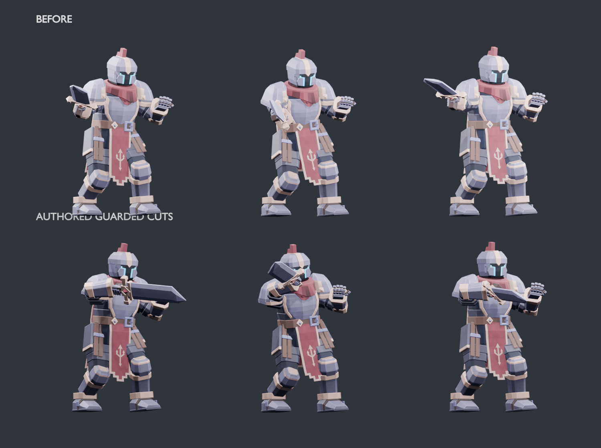

# Chivalry guarded technique pass

The previous guarded cuts blended ordinary Slash poses toward Guard. Their sword paths had little identity and almost constant clavicle posture. This pass authors three independent upper body paths in the saved Blender source while preserving the existing composition architecture.

1. GuardCut_1 is a diagonal forehand across the defended chest line, with a tucked elbow and modest torso commitment.
2. GuardCut_2 returns along the upper line as a compact backhand. The sword hand stays in front of the body.
3. GuardCut_3 is a centered descending beat with a short forward finish. Its silhouette differs from the lateral cuts.

Chest compression, shoulder response, head counterrotation and slight free gauntlet counterbalance accompany the sword. Each action finishes in the existing Guard hold. The authoring uses the physical HeroSword blade direction rather than the differently oriented sword socket.

## Timing and preserved scope

Contacts remain at 0.40, 0.38 and 0.36 seconds within the existing combo slots. Action frame ranges remain 1 through 23, 1 through 23 and 1 through 20. Combat timing, hit windows, damage, stamina, concurrency rules and server authority are unchanged.

Geometry, topology, UVs, vertex colors, skin weights, material assignments, rest bones, ordinary animation curves and guarded lower body curves are preserved against main at b6943875803531eae256eadd7c9933ca97790f45. First person source and GLB bytes are unchanged. The shared manifest revision updates both asset URL cache keys as its existing contract requires.

There are no runtime animation changes in this pass. Existing velocity preserving handovers, Sprint torso carriage and independently owned locomotion, posture, sword and sorcery channels continue to sample the authored clips. First person guarded sword motion remains the previously accepted solver. Voice systems, Credits dialogue, music, Sunder, Vortex and other ultimate mechanics are outside this pass.

## Visual proof

The top row shows the previous contact poses; the bottom row shows the new forehand, backhand and descending beat at their unchanged contact samples.



[Exported motion proof](art/chivalry-technique/guarded-combo.webm) shows the same guarded chain stationary on the left and Sprinting on the right. It uses the production GLB loader, animation planner and animator. The temporary capture overlay was removed after inspection. The proof is an isolated animation study; the browser composition check also exercises casting and Dash handoffs.

## Focused verification

Blender 4.5.14 LTS rebuilt both assets successfully. Third person stays at 12,952 triangles and 2,295,680 bytes, within the 35,000 triangle and 2,400,000 byte budgets. First person remains 4,572 triangles and 705,700 bytes.

The new source test fails against the previous guarded contacts and passes against this candidate. It samples 89 frames per guarded cut, checks contact direction, head tracking, free gauntlet cover, natural arm reach, exact Guard endpoints and source preservation. The existing Chivalry preservation test also passes. Both exported GLBs pass their structural, rig, animation and budget validators.

The browser composition check passes 540 exported skeleton frames: 474 Sprint frames, 66 Dash frames and six returns to the continuing Sprint cadence. It verifies outgoing velocity, interrupted handovers, accepted action clocks and return to ordinary Guard on expiry. The captured motion was inspected at each of the three strikes.

The five relevant Node test files pass all 34 tests: chivalryMotion, chivalryPresentation, spellbladeAnimationPlan, spellblade runtime assets and authored source. Project syntax and diff whitespace checks pass. The full gameplay suite was omitted for this isolated asset pass at the user's request.

## Changed files

1. `tools/blender/characters/spellblade/source/spellblade-third-person.blend`: authored upper body curves in GuardCut_1, GuardCut_2 and GuardCut_3.
2. `client/assets/characters/spellblade/spellblade.glb`: export of those source actions.
3. `client/assets/characters/spellblade/manifest.json`: revision and matching asset cache keys.
4. `tools/blender/characters/spellblade/kit/guarded_technique.py`: focused source authoring utility.
5. `scripts/test-spellblade-guarded-technique.py`: source preservation and defended motion checks.
6. `tools/blender/characters/spellblade/source/README.md`: source editing and validation notes.
7. `docs/art/chivalry-technique/guarded-technique-sheet.png`: rendered contact comparison.
8. `docs/art/chivalry-technique/guarded-combo.webm`: exported runtime motion proof.
9. `docs/CHIVALRY_GUARDED_TECHNIQUE.md`: this handoff.

## Reproduce

Export the baseline source from main before opening the candidate. Then run:

```sh
git show b6943875803531eae256eadd7c9933ca97790f45:tools/blender/characters/spellblade/source/spellblade-third-person.blend > /tmp/chivalry-baseline.blend
blender --background /tmp/chivalry-baseline.blend --python-exit-code 1 --python tools/blender/characters/spellblade/kit/guarded_technique.py -- /tmp/chivalry-candidate.blend
blender --background --factory-startup --python-exit-code 1 --python scripts/test-spellblade-guarded-technique.py -- /tmp/chivalry-baseline.blend /tmp/chivalry-candidate.blend
blender --background --factory-startup --python-exit-code 1 --python tools/blender/characters/spellblade/build.py -- --mode preview --source /tmp/chivalry-candidate.blend --out artifacts/chivalry-technique-build --source-revision 76cc66a7b7f5b6e25e22d08dd55bd227285dfb99
```

Source provenance: the promoted Blender file has Git blob ID 76cc66a7b7f5b6e25e22d08dd55bd227285dfb99. Reauthoring and saving may produce different binary bytes; use that new file's actual blob ID when assigning a fresh export revision.
