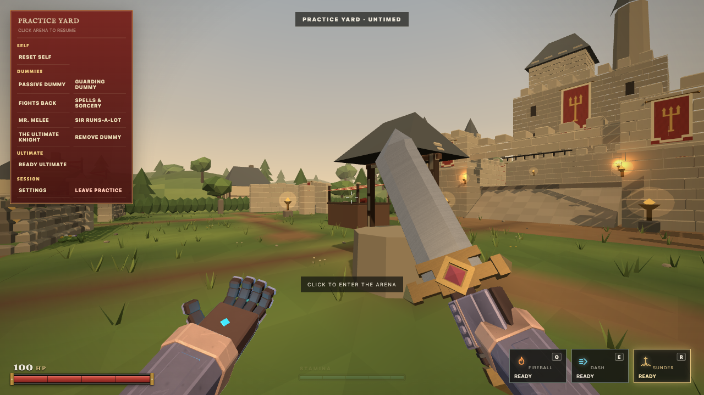
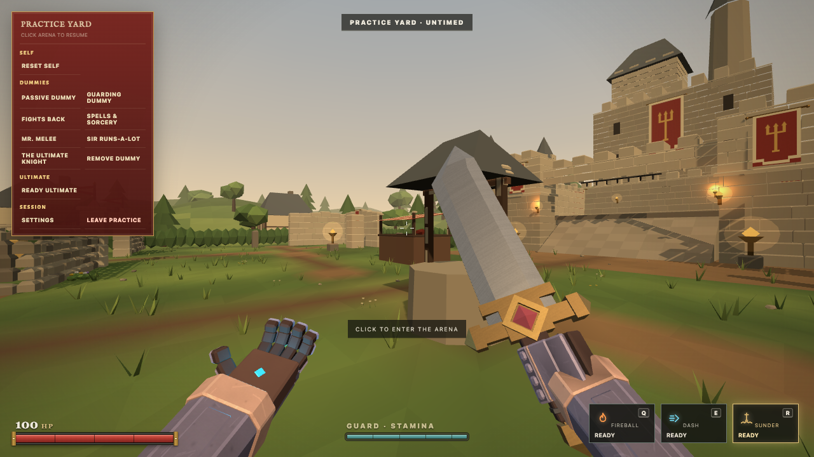
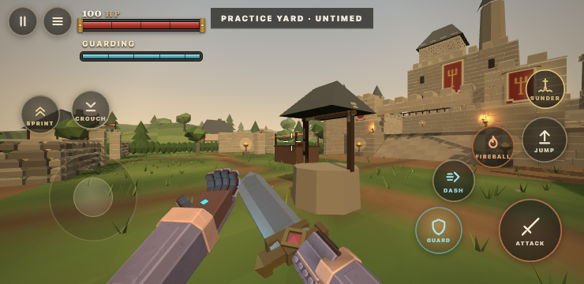
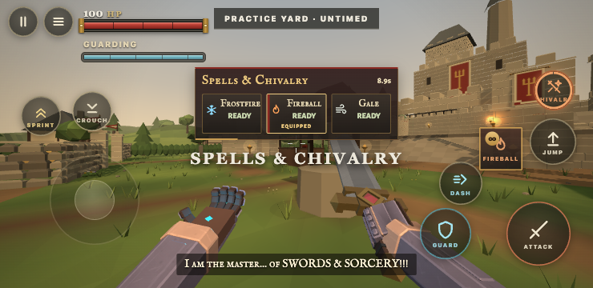

# Combat HUD readability

Baseline: GitHub main `f882655cffadbc47fef1adcf37ee608e49b72a04`. Menu and tour refinements are independent PRs.

## Observed problems and changes

The idle stamina bar was almost invisible in actual gameplay captures: opacity 0.12, a 9 pixel label and the generic word STAMINA. A new player could easily miss that this is Guard's resource.

The same bar now remains readable at rest with opacity 0.72 and a cream 11 pixel label. On touch the label increases from 8 to 10 pixels. Its position, width, draining behavior, refill behavior, colors and Balance indicator remain intact.

The label follows authoritative state:

| State | Label |
| :--- | :--- |
| Resting | GUARD · STAMINA |
| Guarding | GUARDING |
| Sprinting | SPRINTING |
| Guarding and Sprinting | GUARD + SPRINT |
| During authoritative Stagger | GUARD · STAGGERED |
| Below ordinary Sprint restart stamina | GUARD · WINDED |

This does not invent a separate Guard Break flag. The wire snapshot already supplies the genuine Stagger deadline. Once it expires, the display follows the remaining stamina and active actions.

Ordinary spell and Dash cooldowns now include seconds, for example `2.0s` instead of `2.0`. This matches the existing prepared spell display. READY, icons, cooldown shading and current spell identity are preserved.

A touch capture at 740×360 showed the prepared spell information covering the aim point while Chivalry was active. The informational rack now sits 84 pixels below the safe top edge. Its bottom is 175 pixels in this viewport, above the aim point at 180 pixels. The separate drag fan, its targets and spell selection logic are unchanged.

## Gameplay audit evidence

These are real local Room simulation snapshots and production combat events rendered by the actual client. Controlled scenario setup shortened repetitive waiting. Damage, death, kills, parry and Guard break were produced through the production combat functions, rather than fabricated HUD data.

| State | Local capture |
| :--- | :--- |
| Full health, spell ready, ultimate ready, Practice tools | `before-hud-ready.png`, `after-hud-ready.png` |
| Receiving damage | `before-hud-damage.png` |
| Low health | `before-hud-low-health.png` |
| Guarding | `before-hud-guard.png`, `after-hud-touch-guard.png` |
| Successful parry | `before-hud-parry.png`, `after-hud-parry.png` |
| Guard broken by actual sword contact | `before-hud-guard-break.png`, `after-hud-guard-break.png` |
| Spell cooldown | `before-hud-cooldown.png`, `after-hud-cooldown.png` |
| Defeating an enemy | `before-hud-kill.png`, `after-hud-kill.png` |
| Death and respawn | `before-hud-death.png`, `before-hud-respawn.png` |
| Ultimate activation and Chivalry repertoire | `after-hud-chivalry.png`, `after-hud-touch-chivalry.png` |
| Touch combat and cooldown | `after-hud-touch-landscape.png`, `after-hud-touch-cooldown.png` |
| Portrait rotation choice and sideways HUD | `touch-portrait-rotation.png`, `after-hud-touch-sideways.png` |
| Victory and defeat | `audit-victory.png`, `audit-defeat.png` |

All captures are under `output/playwright/ui-refinement/`. Representative evidence is committed below. Existing low health pulses, death cards, subtitles, Practice grouping, kill feedback and result layouts were sufficiently clear in these captures and are preserved.

The automated desktop session rejected pointer lock. Foreground emulation restored browser focus; the local arena readiness command allowed the real Bot Duel countdown to proceed for result captures. Victory and defeat were seeded by a single genuine kill with a temporary scenario score target. Physical mouse entry remains a manual check. The real FIGHT AGAIN and RETURN TO MENU controls were exercised; return preserves the loaded menu without a page reload.

Touch testing used Chromium mobile/touch emulation and real touch events. Holding Guard produced authoritative Guard. Casting showed its cooldown; Chivalry auto Guard and prepared spells were captured. Holding the spell button and dragging to Frostfire selected Frostfire in the authoritative snapshot, confirming that the separate drag fan still works. Portrait retained the rotation prompt and PLAY SIDEWAYS route. This establishes browser behavior, not physical phone ergonomics or screen reader usability.

## Verification

Focused HUD, ultimate view and screen turn tests: 19 passed. Added tests cover authoritative Guard labels, simultaneous Guard/Sprint, Stagger expiry, winded recovery and cooldown units/ready state. Existing prepared spell assertions were updated only for the seconds suffix.

Full `npm run verify`: 1109 tests passed, syntax and HTTP/WebSocket smoke passed.

No gameplay values or combat timing changed. No Blender source or exported assets changed, so asset regeneration is unnecessary.

## Changed files

| File | Purpose |
| :--- | :--- |
| `client/index.html` | Initial Guard label |
| `client/styles.css` | Resting opacity, desktop label size and winded text color |
| `client/playability.css` | Cream Guard text contrast |
| `client/mobile.css` | Readable touch label size |
| `client/ui/HUD.mjs` | Authoritative status labels and cooldown seconds |
| `client/ui/preparedSpells.css` | Touch information rack clears the aim point |
| `client/ui/preparedHud.test.mjs` | Status transitions and cooldown units |
| `docs/COMBAT_HUD_REFINEMENT.md` | Audit, evidence, limitations and validation |
| `docs/evidence/combat-hud/guard-before.png` | Original desktop capture |
| `docs/evidence/combat-hud/guard-after.png` | Updated desktop capture |
| `docs/evidence/combat-hud/touch-guard.png` | Actual emulated touch Guard |
| `docs/evidence/combat-hud/touch-chivalry.png` | Updated touch repertoire placement |

## Deferred opportunities

Physical phone comfort, larger touch pause/score buttons and native screen reader navigation deserve direct device testing. Pause and scores are 38 pixels in the captured landscape view; all combat controls are at least 50 pixels. Their current arrangement remains intact rather than enlarging them speculatively.

The first visit still needs a Spellblade name. The existing validation focuses the field and states what is missing; an intrusive introduction would add friction. Play mode descriptions are clarified in the menu PR instead.

Voice lines, Credits recordings, menu music/autoplay, ultimate mechanics, animation assets, networking and support integration are deliberately untouched. This is a draft for approval and must remain unmerged.
