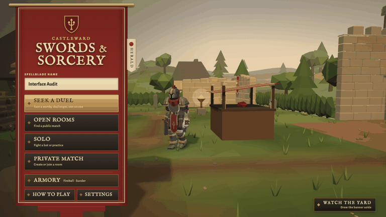
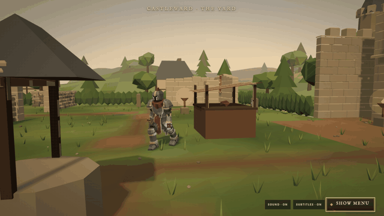

# Continuous Castleward tour

Baseline: f882655.

The introductory circuit retains its three second pose and acceleration. Its final leg now runs to the route seam at full speed. Later circuits begin at full running speed with no introductory rest or acceleration. Fight anchors, choreography, rare encounter order, and Sky Bait memory remain unchanged.

The route positions are unchanged. Heading now interpolates neighboring sample tangents, including at the closed seam. TourDirector keeps its camera view, hero yaw, animator, and footfall state through the boundary. The entrance camera applies only to the initial departure. Rival and debris restoration is deferred until it is outside the camera view.

Verification: all 29 tour tests passed; full npm run verify passed with 1108 tests and the HTTP/WebSocket smoke test.

Browser evidence is captured from the production renderer and animator at 60 simulation frames per second around two consecutive circuit boundaries, in both Command View and Watch the Yard. Full circuits between captures were advanced through the same TourDirector update method. Capture frame filenames identify the mode, circuit, and frame. Audio was muted for capture. This is controlled timeline evidence rather than a real time screen recording.

Local capture directory: output/playwright/ui-refinement. Boundary states include route position, speed, yaw, gait phase, and camera position. The adjacent frames show the running pose and tracking camera continuing across the seam. The introductory camera is retained on a fresh menu entrance.

The first motion capture also exposed a rival popping back into the background. Round changes now retire the outgoing tableau. Each rival is restored only when both its old shape and incoming location are outside the tracking camera, with a conservative margin. Its flag keeps the outgoing time while waiting. Retired debris is removed outside the view; debris merging keeps retired and fresh pieces separate so new encounter props cannot be collected accidentally. Sky Bait memory remains separate from this visual lifecycle.

The final capture drives the actual observation controller, including the banner withdrawal, and advances the shared particle effects along with the tour. It asserts that a rival is ready before its authored encounter. It covered the intervening next circuit and the final Watch circuit without a pending rival at a fight.

The 56 adjacent boundary frames remain at 5.5 m/s, with a maximum movement step of 0.091667 m at 60 simulation frames per second. Both boundaries in each presentation span successive rounds. The JSON includes position, yaw, gait phase, camera and pending restoration state.

These GIFs play the adjacent frames about five times slower. Each cuts from the end of the first sampled boundary to the beginning of the second. They are controlled timeline captures, not recordings of entire circuits. The original frame images remain in the local capture directory.

Reproduction script: `docs/evidence/tour/capture.js`, passed to the Playwright CLI `run-code` command against the debug local game. The script mutes its capture only; game audio code is unchanged.

Changed files:

1. `client/menu/tour/tourSchedule.mjs`: first circuit introduction and full speed seam.
2. `client/menu/tour/TourDirector.mjs`: circuit continuity, retained camera/gait, and restoration outside the view.
3. `client/menu/tour/tourPath.mjs`: continuous sampled heading, unchanged route positions.
4. `client/menu/tour/tourProps.mjs`: retired debris identity survives merging.
5. `client/menu/tour/tour.test.mjs`: physical speed, position and heading seam checks.
6. `docs/CONTINUOUS_MENU_TOUR.md`: behavior, verification and capture protocol.
7. `docs/evidence/tour/boundaries.json`: exact sampled states.
8. `docs/evidence/tour/capture.js`: reproducible browser capture and encounter readiness assertions.
9. `docs/evidence/tour/command-boundaries.gif`: two Command View boundaries.
10. `docs/evidence/tour/watch-boundaries.gif`: two Watch the Yard boundaries.
