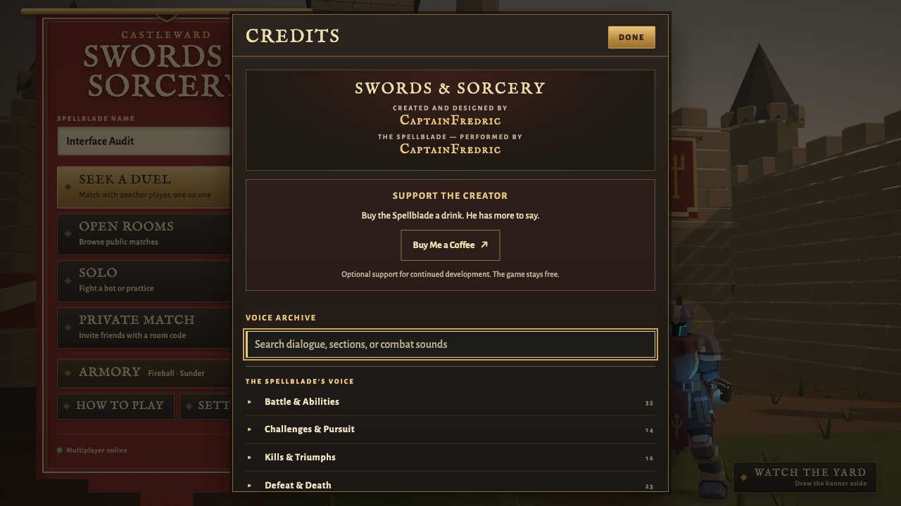
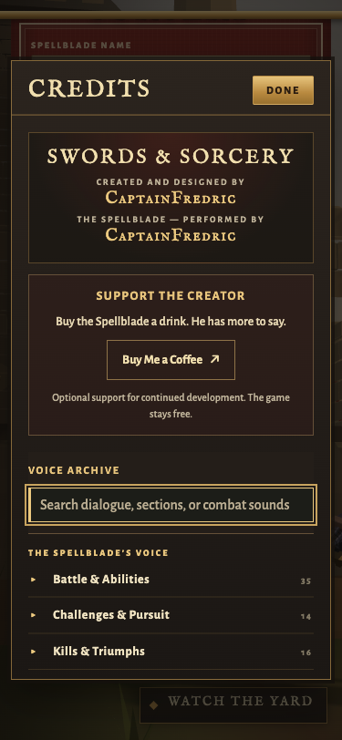

# Optional creator support

Baseline: current main `aad49e8e46ffeb70da394ec91e3345f8c6f6d888`, including the merged tour, menu and HUD drafts.

The creator requested help updating the public Buy Me a Coffee page and the small support section in Credits. The public page now identifies CaptainFredric and Swords & Sorcery, explains the free game and optional support, links to the playable game, and uses the requested Spellblade invitation. Its 70 character short description limit required a shorter line. The authored thank you message was saved and verified in the site's preview. Public profile editing remains separate from this source change.

The Credits section sits immediately after creator attribution and before the voice archive. It says “Buy the Spellblade a drink. He has more to say.” One secondary link opens the verified public page in a new tab, with `noopener noreferrer` and an accessible label identifying the destination and new tab. The note explains that support is optional and the game stays free.

The section uses the existing iron, crimson and brass palette. It contains a 44 pixel link target and visible keyboard focus. It stays outside the dynamically rebuilt attribution and voice library, preserving the link during archive searches. The existing Credits focus containment already includes anchors.

No third party widget, embedded checkout, analytics request, popup, gameplay reward or voice change is introduced. The ordinary link loads the external page only when clicked.

## Verification

Full `npm run verify` passed: 1111 tests, syntax validation and HTTP/WebSocket smoke.

Chromium browser checks passed at 1280×720, 740×360 and 375×812. They verified attribution/support/archive order, absence of horizontal overflow, exact destination and external link attributes, keyboard focus scrolling the link into view, Tab continuing to archive search, search retaining one support section, and Escape restoring the Credits opener.

Screenshots were inspected at desktop and compact sizes. The short viewport uses existing internal scrolling; the Done button remains fixed and available. Existing voice content and search behavior remain intact. The full interface audit and device limits are documented in the preceding menu and HUD reports.

## Changed files

1. `client/index.html`: static optional support section in Credits.
2. `client/menu.css`: restrained support styling and visible focus.
3. `docs/CREATOR_SUPPORT.md`: behavior and validation.
4. `docs/evidence/creator-support/credits-desktop.png`: desktop capture.
5. `docs/evidence/creator-support/credits-narrow.png`: narrow capture.

The public page changes are saved. This game change is a separate draft for approval before publication.
