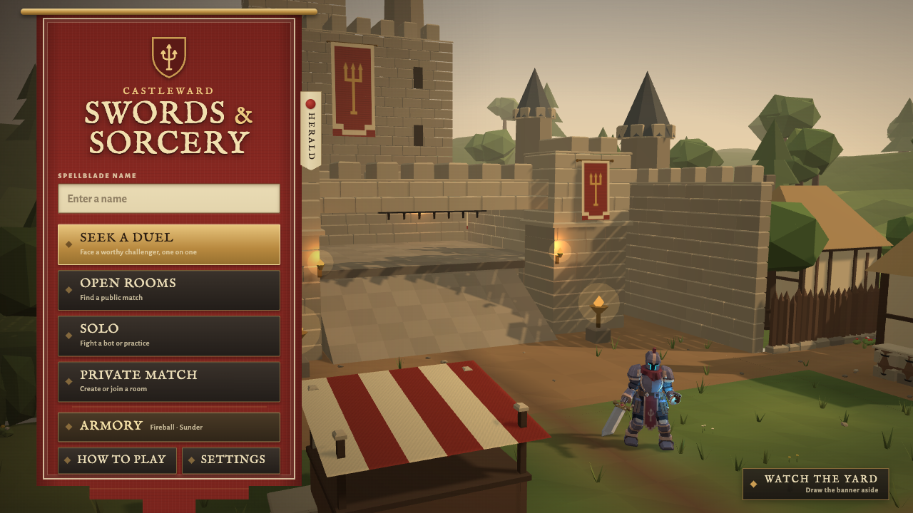
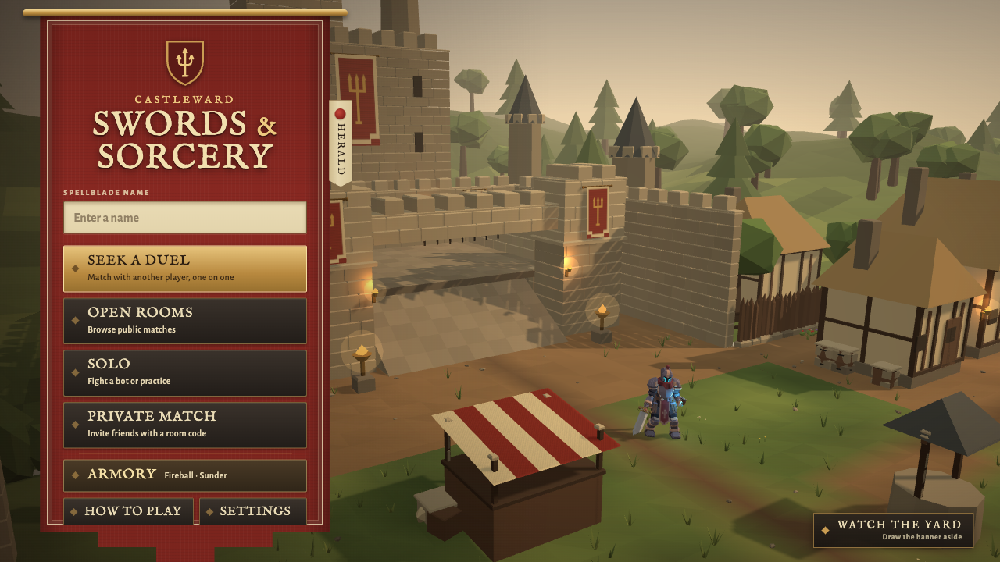
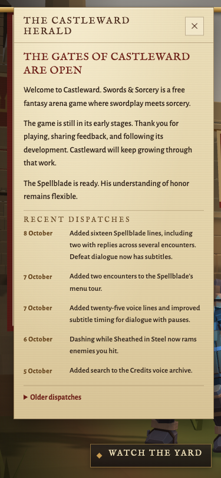
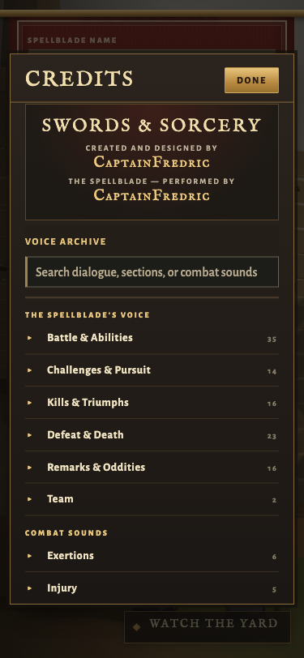

# Menu, Herald and Credits refinement

Baseline: GitHub main `f882655cffadbc47fef1adcf37ee608e49b72a04`. This branch leaves the continuous tour and combat HUD to separate PRs.

## Audit and decisions

The crimson standard, brass rod, gold duel command and live Castleward scene already establish a strong identity. Solo, private rooms, public rooms, loadout summaries, bot difficulties, touch controls, Renown and Challenges already exist. They remain intact.

Actual browser inspection found lower menu commands competing with the decorative hem at small heights. The content now scrolls within the standard while the hem remains outside that scroll. Main menu, Solo, rooms, private match, How to Play and lobby use this separation. Armory retains its existing specialized scrolling.

The main command descriptions are slightly larger and brighter. They identify matching, browsing public rooms, training and invitations directly. Existing online status and truthful offline bot fallback remain.

Credits now presents authorship first, followed by a labeled voice archive search. Searching recordings preserves attribution. The existing categories, recordings, jokes and archival annotations remain unchanged.

The Herald opens with a welcome, five recent dispatches and a folded older archive. Existing dates and verified history are retained. The welcome uses third person; publication awaits approval of this draft PR.

## Major wording

| Location | Before | After |
| :--- | :--- | :--- |
| Seek a Duel | Face a worthy challenger, one on one | Match with another player, one on one |
| Open Rooms | Find a public match | Browse public matches |
| Private Match | Create or join a room | Invite friends with a room code |
| Credits search | Search the Credits | Search the voice archive |
| Search placeholder | Search lines, sections, when he says them… | Search dialogue, sections, or combat sounds |
| Empty search | Nothing in the Credits matches… | No voice lines match… |
| Herald headline | The front door steps aside | THE GATES OF CASTLEWARD ARE OPEN |

The welcome says:

> Welcome to Castleward. Swords & Sorcery is a free fantasy arena game where swordplay meets sorcery.
>
> The game is still in its early stages. Thank you for playing, sharing feedback, and following its development. Castleward will keep growing through that work.
>
> The Spellblade is ready. His understanding of honor remains flexible.

## Additional discoveries

| Evidence | Issue and consequence | Small coherent action | Risk and decision |
| :--- | :--- | :--- | :--- |
| Source inspection | Asynchronous voice manifest loading replaces focused playback controls. Keyboard browsing can lose its position. | Restore the matching line/take or section summary after redraw. | Local DOM change, implemented. |
| Source inspection | A queued preview retry can outlive a closed Credits panel. | Check panel visibility and attached button before retry playback. | Local preview boundary, implemented. Voice director unchanged. |
| Browser keyboard test | Collapsed details retain descendant client rectangles. Counting those buttons traps Shift+Tab on a control that cannot receive focus. | Exclude folded descendants while keeping each summary. | Local focus containment, implemented and tested in Chromium. |
| Gameplay capture | Idle Guard stamina fades to 12 percent opacity and only says STAMINA. | Name Guard and keep it readable at rest. | Deferred to the separate HUD PR. |

Native screen reader testing and physical phone comfort remain useful follow up checks. Emulation alone cannot establish either.

## Verification and visual evidence

Focused front door, Credits search and voice library tests: 23 passed. Full `npm run verify`: 1108 passed, syntax check and HTTP/WebSocket smoke passed.

Chromium browser checks cover 1920×1080, 1280×720, 1024×768, 740×360 and 375×812. At every size, scrolling reaches Credits above the hem. Herald and Credits were captured at desktop and narrow portrait sizes. Escape clears voice search before closing; close restores the Credits opener. Keyboard focus stays within visible controls. Reduced motion and larger description text were inspected at a compact effective viewport.

The browser initially served cached CSS. Cache was disabled and final captures were regenerated. A software graphics session became unresponsive during extended capture; a fresh Metal graphics session completed the menu checks.

Local captures live under `output/playwright/ui-refinement/`. The representative images below are committed with this report.

## Changed files

| File | Purpose |
| :--- | :--- |
| `client/index.html` | Scroll regions, clear command descriptions and Credits structure |
| `client/menu.css` | Scroll/hem separation, type contrast, Herald spacing and archive focus |
| `client/menu/frontDoor.test.mjs` | Welcome and dispatch hierarchy assertions |
| `client/ui/CreditsPanel.mjs` | Stable attribution, search empty state, keyboard focus and safe preview retry |
| `client/ui/HeraldPanel.mjs` | Recent dispatches and folded archive |
| `client/ui/heraldNotices.mjs` | Welcome and clear verified history |
| `server/tests/client-shell.test.mjs` | Updated command copy contract |
| `docs/MENU_UI_REFINEMENT.md` | Audit, decisions and validation |
| `docs/evidence/menu-ui/menu-before.png` | Original desktop capture |
| `docs/evidence/menu-ui/menu-after.png` | Updated desktop capture |
| `docs/evidence/menu-ui/herald-narrow.png` | Narrow Herald capture |
| `docs/evidence/menu-ui/credits-narrow.png` | Narrow Credits capture |

## Deliberately preserved

Combat rules, server authority, voice direction, recorded dialogue, menu music/autoplay, ultimate tuning, Blender assets and existing transition timings are unchanged. The existing in place return and touch/safe area handling are preserved. The external support profile and support link await the creator's confirmation. This PR is a draft and must remain unmerged until approved.
