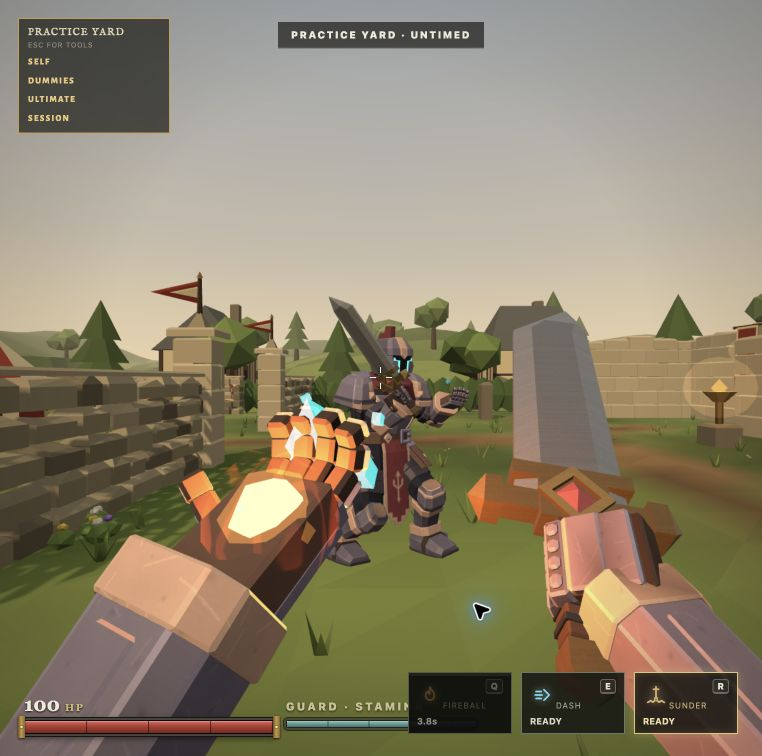

# Swords & Sorcery project copy

## Saved itch metadata

Title: Swords & Sorcery

Slug: swords-and-sorcery

Tagline: Sword in one hand. Sorcery in the other. Duel friends, fight bots, or learn your craft in Castleward.

Game · HTML · Action · In development · Free · Draft

Selected tags: fantasy, first-person, magic, medieval, multiplayer, pvp, swords.

Generative AI disclosure: Yes. Graphics, Text & Dialog, and Code selected. Sounds left unselected because the creator's recorded voice and the procedural sound engine are identified separately. Recheck this distinction if later music or sound assets use generated recordings.

The exact saved rich description is in [itch-description.html](itch-description.html).

The gallery now leads with the new landscape Fireball gameplay capture. Five images are saved while visibility remains Draft. The [27 second trailer](media/castleward-trailer.mp4) is prepared for creator review and hosting; it has not been published or embedded on itch.

## Initial devlog draft

Title: Welcome to Castleward

Swords & Sorcery started with a knight who could carry a sword in one hand and gather a spell in the other. I wanted the duel to stay physical: close the distance, meet a strike with Guard, then find the moment for sorcery. The Spellblade developed a few opinions along the way. His understanding of chivalry remains flexible.

You can now duel a friend with a room code, find an open room, fight bots or try your moves in the Practice Yard. The Armory lets you choose spells, an ultimate and your knight's appearance.

This is a playable pre alpha. I am still refining combat, animations, presentation and browser compatibility. I created the concepts, mechanics and dialogue, and perform the Spellblade's voice. AI tools have helped build and revise the game through a great deal of direction, testing and iteration.

[Play in your browser](https://captainfredric.github.io/swords-and-sorcery/). If you run into a problem, tell me your device and browser, what you tried and what happened. A short clip is especially helpful.

Thank you for visiting Castleward.

This devlog is prepared copy, not a published post. Once the itch client passes its actual iframe tests, the primary play link can point to the working itch launch. The standalone URL remains available.
